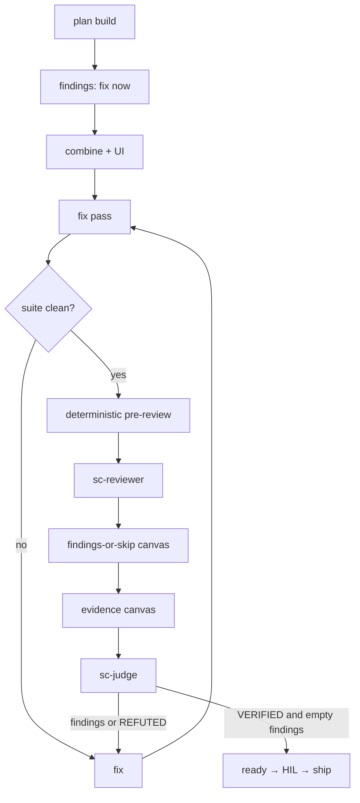

# sc-run

## Goal

After `/sc-discuss` clear, AFK incomplete work to `ready` for human check, then `/sc-ship`. Supports multi-mission roadmap queue **or** mission-only (`Sizing: single|phases`).

## Output

Missions at `state=ready` (or stop on blocked / clarify / missing draft approval). Handoff: **Ready. Human check, then /sc-ship.** Never merge/push/tag.

## Good / Bad

- Good: discuss clear first; plan → build → combine(+UI) → fix findings → review → findings-or-skip canvas → evidence canvas → `sc-judge`; empty review findings; `sc-judge` `VERIFIED`; real evidence; summary lists what was fixed; Cursor Canvas at plan / findings-or-skip / evidence (before judge) with greppable `decisions.md` lines + absolute markdown links
- Bad: shipping; discuss work mid-AFK; parking defects for later; ready with review findings; ready without `sc-judge` or without `VERIFIED`; caveat / soft-pass ready; invent phrase-echo RED for docs/prose; demanding UI draft on `*-data` / `*-functional` / `*-integrate` seams; ready without applicable Canvas plan / findings-or-skip / evidence decisions lines; chat-only canvas link without the decisions line; canvas under mission `.space/` or repo `.cursor/`; mission brief or draft HTML / visual SoT as canvas; invoking `sc-judge` on the ready path without a greppable `Canvas evidence:` line

## Verify

`spacecraft validate --strict` per mission; roadmap mode: `map next` until `All missions complete.` or blocked tip; mission-only: that one mission `ready`. Before `ready`: `decisions.md` has greppable `Canvas plan:`, `Canvas findings:` or `Canvas findings skipped: empty`, and `Canvas evidence:` lines with absolute paths (and matching files under managed `canvases/` when a canvas is required).

## Arguments

`$ARGUMENTS` = roadmap id (optional).

```
spacecraft map use <roadmap-id>
/sc-run <roadmap-id>
# or /sc-run  → map current if set; else mission-only on spacecraft resolve/current
```

## Lifecycle

Canonical: `.cursor/rules/200-workflow.mdc` - discuss (HIL) → run (AFK) → human check → ship.

## Pre-flight

1. Resolve mode:
   - If `$ARGUMENTS` set → `map use` that roadmap (**roadmap mode**).
   - Else if `spacecraft map current` succeeds → **roadmap mode** on that id.
   - Else resolve mission via `spacecraft resolve` / `current` → **mission-only mode** (one mission; no map required). Fail only if neither roadmap nor mission resolves.
2. Incomplete mission with `clarify-status` `open` → stop; `/sc-discuss`.
3. Draft gate (visual only):
   - Require `UI draft approved: …` when the mission is visual UI/FE (`*-ui` title, or `Sizing: single|phases` without a non-visual skip).
   - Do **not** require draft when `decisions.md` has `UI draft skipped: non-visual seam (data|functional|integrate)` or another recorded non-visual skip. `*-integrate` tips use `UI draft skipped: non-visual seam (integrate)` - no draft demanded.
   - Missing required draft → stop; `/sc-discuss`.
4. Soft gaps → `decisions.md`. No design-brief / draft-HTML discovery here.

## Mission canvas milestones

Emit Cursor Canvas artifacts at plan, post-review findings-or-skip, and evidence (before `sc-judge` on the ready path). Mid-build short chat dumps are **not** required as canvases.

**Live path (IDE detect only):** `~/.cursor/projects/<workspace>/canvases/<missionId>-<kind>.canvas.tsx` where `kind` ∈ `plan` | `findings` | `evidence`.

**Must not** write `.canvas.tsx` under mission `.space/` or repo `.cursor/` - Cursor IDE detects only managed `canvases/`.

**Greppable `decisions.md` lines** (absolute paths; chat + `decisions.md` include absolute markdown links when a canvas exists):

| Milestone | Required line |
|-----------|---------------|
| Post-plan | `Canvas plan: ` + absolute path ending in `<missionId>-plan.canvas.tsx` |
| Post-review (nonempty findings) | `Canvas findings: ` + absolute path ending in `<missionId>-findings.canvas.tsx` |
| Post-review (empty findings) | `Canvas findings skipped: empty` (no findings canvas file) |
| Before `sc-judge` (ready path) | `Canvas evidence: ` + absolute path ending in `<missionId>-evidence.canvas.tsx` |

Gate is file existence under managed `canvases/` plus those decisions lines only - do not inspect canvas TSX/JSON shape. Chat-only link without the matching decisions line fails the ready gate.

**Must not:** replace mission brief (Accept/Adjust/Reject chat HIL) with a canvas; use canvas as draft HTML / visual SoT.

## AFK loop

**Roadmap mode:**

```
spacecraft map next <roadmap-id>
```

Stop when: `All missions complete.`, tip `blocked`, hard clarify, or missing draft approval.

**Mission-only mode:** run the single resolved mission through **Per incomplete mission** once; then stop (no `map next`).

### Per incomplete mission

1. Parse id from `map next` (`M…:`); `spacecraft use <id>`.
2. Branch `feat/<id>/…` from main; `spacecraft bind-branch <id>` if needed.
3. Spec already discuss-ready; Task(`sc-planner`) → `plan.json`; `set-state planned` then `in_progress`. **Post-plan canvas:** write `<missionId>-plan.canvas.tsx` under managed `canvases/`; append `Canvas plan: ` + absolute path to `decisions.md`; include an absolute markdown link in chat (and `decisions.md`).
4. **Build (per acceptance)** - for each pending task / `acceptance[]`:
   1. Triage via sc-tdd; record `skip: <reason>` when tautology (docs/prose/wording-only).
   2. **TDD:** RED Task(`sc-tester`) → checkpoint → GREEN Task(`sc-coder`/`sc-firmware`) → evidence → checkpoint.
   3. **Skip:** direct write - Task(`sc-writer`) for docs/prose/wording-only, Task(`sc-coder`) for other tautologies - → evidence with task `verify` → one checkpoint. No phrase-harness scripts.
   4. **Findings mid-build:** fix now (especially if it blocks current acceptance or the suite). When recording/reporting defects, use impact-first craft from `references/defect-finding.md` (especially critical/important). Note each fix for the run summary.
   5. Mark task `done` only when all its acceptances pass.
5. **Combine:** refactor; full suite; evidence. Fix any new failures. Checkpoint.
6. **UI recheck (visual UI/FE):** Start the app → Tier 3 on the **running product URL** (`playwright-cli` primary; open real product routes; live screenshots at 375 / 768 / 1280, + 1536 when multi-region) → capture matching draft-surface screenshots (serve/open approved draft HTML; `[data-draft-surface]` only; same viewports) → record **both** path sets → Step 0 **draft-parity** (side-by-side LLM/browser compare draft vs live: tokens, layout, component chrome, scenario states) → Task(`sc-designer`) live critique (**live-product** + **draft-parity**, both image sets + live URL) → fix critical/important → re-capture paired evidence → then review. Layout-only match with different chrome, missing draft `data-state` coverage in the product, or missing paired screenshots → fix now. Draft HTML serve alone does not satisfy live-product; draft-parity requires the pair. Pair with the functional suite. No ready yet.
7. **Fix pass** - until suite (+ UI if UI) is clean:
   1. Fix mission-caused / suite-breaking / touched-path defects. For critical/important findings, follow `references/defect-finding.md` (impact-first title, user impact, 2-3 retest ideas).
   2. Unrelated preexisting that is not suite-breaking and not on touched path → note in summary only.
   3. Same issue fails fix-verify **3** times or hard blocker → stop to human.
8. **Review + sc-judge** (only after suite clean + deterministic pre-review):
   1. **Deterministic pre-review (required):** `spacecraft validate --strict`; confirm done tasks have matching `evidence.jsonl`; when scope matches, run/capture security and/or performance machine-first evidence per `.cursor/skills/sc-run/references/mission-review-gates.md` (Commander-side read-only checks; then heuristic `Task(sc-security)` when auth/API/secrets/deps touched - do not violate `sc-security` no-dynamic-tools rule).
   2. Task(`sc-reviewer`) consuming `mission-review-gates` (+ Task(`sc-designer`) / `ux-ui-review-gates` when visual UI).
   3. **Post-review canvas:** when `review.json` findings are nonempty → write `<missionId>-findings.canvas.tsx` under managed `canvases/`; append `Canvas findings: ` + absolute path to `decisions.md`; absolute markdown link in chat (and `decisions.md`). When findings are empty → append only `Canvas findings skipped: empty` (no findings canvas file).
   4. **Evidence canvas (always before judge on the ready path):** write `<missionId>-evidence.canvas.tsx` under managed `canvases/`; append `Canvas evidence: ` + absolute path to `decisions.md`; absolute markdown link in chat (and `decisions.md`). Confirm greppable `Canvas plan:`, findings-or-skip, and `Canvas evidence:` lines exist (chat-only link without a decisions line blocks).
   5. Run sc-judge; evidence label including `judge`. Verdict is binary: `VERIFIED` | `REFUTED` (no caveats).
   6. Any findings (any severity) or `REFUTED` → fix remediation now → re-review + re-emit canvases as needed (findings-or-skip, then evidence) → re-judge. Do not set ready.
   7. On `VERIFIED` + `review.json` `status: ready` + empty `findings`: confirm canvas decisions lines still present; `validate --strict`; `set-state ready`. Block ready if any applicable canvas decisions line is missing.
9. Handoff: **Ready. Human check, then /sc-ship.** Include a short **Fixes** list in the summary. When UI or multi-step workflow was touched: also `Recommend: /sc-browser-probe` (recommend-only escape net; not a ready gate - does not replace sc-verification or sc-judge). Continue `map next`. Squash is `/sc-ship` only. On ready (or blocked/stop) handoff, set or update optional `mission.json` `pickup` (`phase`, `next` one-liner, `updatedAt`) so `spacecraft status` / session-start shows Pickup. Not a ready or closeout gate.



## Checkpoint commits

Auto-commit after every RED, GREEN, skip+evidence, combine, and material fix. Conventional Commits; no mission id in subject/body. Never push. See sc-git.

## Rules

- Never `/sc-ship`, merge, push, tag; never discuss/draft work mid-AFK.
- One feature branch per mission id; Task-delegate product code/tests.
- Ready only after `sc-judge` `VERIFIED` and empty review findings (any severity blocks). Never ready on `REFUTED` or caveat soft-pass.
- Ready-path canvas order: findings-or-skip → evidence canvas → `sc-judge` → `set-state ready` on `VERIFIED`. Emit evidence canvas before judge (not after `VERIFIED`).
- Ready only when `decisions.md` has applicable `Canvas plan:`, `Canvas findings:` or `Canvas findings skipped: empty`, and `Canvas evidence:` lines (and required canvas files exist under managed `canvases/`).
- Must fix blockers after plan+combine(+UI); report fixes in the run summary.
- After feature/command cuts: rewrite survivors as current product only (Cut hygiene in `000-spacecraft.mdc`) - no tombstones in prompts/docs/tests.
- After 3 failed fix-verify on the same issue → human.
- Must not put canvases under mission `.space/` or repo `.cursor/`; must not replace mission brief or draft HTML / visual SoT with a canvas.

## References

- `/sc-discuss`, `/sc-ship`
- sc-judge - ready prove gate
- sc-ux-design - post-build live product QC + draft-parity
- sc-web-frontend - port look from approved draft
- `references/defect-finding.md` - actionable defect findings for review/summary
- `references/mission-review-gates.md` - five-gate mission review; deterministic pre-review before reviewer
- Mission canvas milestones (this skill) - plan / findings / evidence under managed `canvases/`
