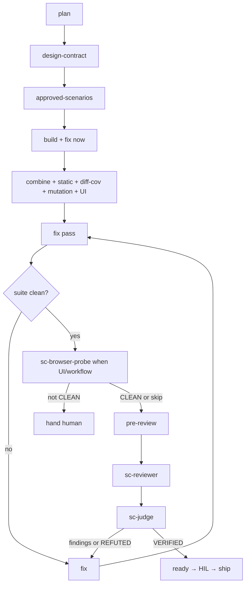

# sc-run

## Goal

After `/sc-discuss` clear, AFK incomplete work to `ready` for human check, then `/sc-ship`. Supports multi-mission roadmap queue **or** mission-only (`Sizing: single|phases`).

## Output

Missions at `state=ready` (or stop on `3-cycle` / `timebox` / `blocked` / clarify / missing draft approval). On AFK stops write `.space/missions/<id>/handback.md` with stop reason + remaining work cue. Handoff when ready: **Ready. Human check, then /sc-ship.** Never merge/push/tag.

## Good / Bad

- Good: discuss clear first; plan → design-contract → approved-scenarios → build → combine (+UI, static + diff-cov + mutation disposition) → fix → Task(`sc-browser-probe`) when UI/workflow → review → `sc-judge`; empty review findings; `sc-judge` `VERIFIED`; real `evidence.jsonl` + `review.json` + `validate --strict`; A/B/C disposition per `docs/mission-artifacts.md`; optional canvas for human check only
- Bad: shipping; discuss mid-AFK; parking defects; product RED/GREEN without design-contract / approved-scenarios (or docs/prose skips); thawing scenario literals; coder editing tests to force GREEN; ready without static/diff-cov/mutation evidence or skip/waive; ready with findings or without `VERIFIED`; ready with in-scope probe not `CLEAN`; invent phrase-echo RED for docs/prose; canvas as ready/`VERIFIED` proof; skipping Task(`sc-browser-probe`) when UI/workflow was touched

## Verify

`spacecraft validate --strict` per mission; roadmap: `map next` until complete or blocked; mission-only: that mission `ready`. Before `ready`: matching `evidence.jsonl`, empty `review.json` findings, `sc-judge` `VERIFIED`; when UI/workflow in scope, `PROBE: CLEAN` (or probe skip for non-UI). Canvas files are optional human-check aids - not ready proof.

## Arguments

`$ARGUMENTS` = roadmap id (optional). `spacecraft map use <id>` then `/sc-run <id>`, or `/sc-run` → map current if set, else mission-only via `spacecraft resolve`/`current`.

## Pre-flight

1. Resolve mode: `$ARGUMENTS` → roadmap; else `map current` → roadmap; else mission-only. Fail only if neither resolves.
2. Incomplete mission with `clarify-status` `open` → stop; `/sc-discuss`.
3. Draft gate (visual only): require `UI draft approved: …` for visual UI/FE unless `UI draft skipped:` (including non-visual seams). Missing required draft → stop; `/sc-discuss`.
4. Soft gaps → `decisions.md`. No design-brief / draft-HTML discovery here.

## Overnight profile

After `/sc-discuss` clear, AFK `/sc-run` avoids mid-HIL except hard blocks. Stop on `3-cycle` | `timebox` | `blocked`. On those stops write `.space/missions/<id>/handback.md` (stop reason + remaining work cue). No overnight runner CLI.

## Optional canvas (human check)

May emit plan / findings / evidence canvases under `~/.cursor/projects/<workspace>/canvases/` (`<missionId>-<kind>.canvas.tsx`). Optional `decisions.md` lines: `Canvas plan:`, `Canvas findings:`, `Canvas findings skipped: empty`, `Canvas evidence:` + absolute path. Do not write canvases under mission `.space/` or repo `.cursor/`. Missing canvas does not block ready or `sc-judge`. Do not replace mission brief or draft HTML / visual SoT with a canvas.

## AFK loop

**Roadmap:** `spacecraft map next <id>` until complete, blocked, hard clarify, or missing draft. **Mission-only:** one resolved mission through the steps below once.

### Per incomplete mission

1. Parse id; `spacecraft use <id>`; branch `feat/<id>/…`; bind if needed.
2. Task(`sc-planner`) → `plan.json`; `set-state planned` then `in_progress`. Optional post-plan canvas for human check.
3. **Design-contract (before build)** - write `.space/missions/<id>/design-contract.md` (`Design-contract: complete`) per `docs/mission-artifacts.md`, or append `Design-contract skipped: docs/prose-only`. **Must not** start product RED/GREEN until complete or skip.
4. **Approved-scenarios (before build)** - freeze `.space/missions/<id>/approved-scenarios.md` (`Approved-scenarios: frozen-from-contract` or `frozen-by-human`), or append `Approved-scenarios skipped: docs/prose-only`. Agents Must not edit frozen expected literals; oracle changes need Commander + `Scenario oracle change: <id> - <reason>`.
5. **Build (per acceptance)** - triage via sc-tdd; record `skip: <reason>` when tautology (docs/prose/wording-only).
   - **TDD:** RED Task(`sc-tester`) → GREEN Task(`sc-coder`/`sc-firmware`) → evidence. One checkpoint per plan task after acceptances done. Tester/coder read contract + scenarios when present; coder **Must not** edit tests.
   - **Skip:** Task(`sc-writer`) for docs/prose, Task(`sc-coder`) for other tautologies → evidence with task `verify` → one checkpoint. No phrase-harness scripts.
   - Fix mid-build blockers now; mark task `done` only when all acceptances pass. Impact-first craft: `references/defect-finding.md`.
6. **Combine:** refactor; full suite; evidence. **Static / diff-cov / mutation:** run tools or record disposition - labels `static-…` / `diff-cov-…` / `mutation-…`, or greppable lines (`Static-analysis skipped:…`, `Mutation skipped:…`, etc.) whose exact prefixes live in `docs/mission-artifacts.md`. Static: **0 warning / 0 error** when a project static tool runs (else skip/waive). Diff cov: touched executable **line and branch ≥90%** when measured. Mutation: in scope when any of `Mutation: required` | pack `quality` | `Mutation: high-risk` (`docs/mission-artifacts.md`); then **>80%** scoped when tool present; else `Mutation skipped: not in scope` is valid. Never chase global 95–100%. Checkpoint.
7. **UI recheck (visual UI/FE):** live product URL + paired draft-surface screenshots → draft-parity → Task(`sc-designer`) → fix critical/important → re-capture → then review. Details: sc-ux-design. No ready yet.
8. **Fix pass** - until suite (+ UI if UI) clean. Unrelated preexisting non-blockers → note in summary. Same issue fails **3** times → human.
9. **Browser probe (UI or multi-step workflow):** Task(`sc-browser-probe`) on the live product URL (scope `feature:<name>` or `full`). Skill AFK fix-loops every finding (critical / important / minor) until `PROBE: CLEAN`. Not `CLEAN` after stop (`3-cycle` / `timebox` / `blocked`) → write `.space/missions/<id>/handback.md`; hand human; do not ready. Skip when no runnable UI/workflow surface. Details: sc-browser-probe.
10. **Review + sc-judge** (suite clean + probe CLEAN or skipped + deterministic pre-review):
   1. `validate --strict`; matching `evidence.jsonl`; approved-scenarios freeze (or skip); static / diff-cov / mutation disposition; security/perf machine-first when scope matches (`references/mission-review-gates.md`).
   2. Task(`sc-reviewer`) (+ Task(`sc-designer`) when visual). Optional findings/evidence canvases for human check.
   3. Run sc-judge (`judge` in evidence label). Verdict: `VERIFIED` | `REFUTED` only.
   4. Findings or `REFUTED` → fix → re-review → re-judge. Do not set ready.
   5. On `VERIFIED` + empty findings + `review.json` `status: ready`: `validate --strict`; `set-state ready`. Proof is evidence + review + validate + judge - not canvas.
11. Handoff: **Ready. Human check, then /sc-ship.** Include **Fixes** list. Update optional `mission.json` `pickup`. Continue `map next` in roadmap mode.

## Checkpoint commits

One Conventional Commit per plan task after acceptances done; combine and material-fix checkpoints may remain. Docs/prose skip: one `docs:` / `feat:` / `fix:` checkpoint - no invented RED `test:`. See sc-git. Never push.

## Rules

- Never `/sc-ship`, merge, push, tag; never discuss/draft mid-AFK (overnight: mid-HIL only on hard blocks).
- On stop `3-cycle` | `timebox` | `blocked` → `.space/missions/<id>/handback.md` with stop reason + remaining work cue.
- Task-delegate product code/tests; one feature branch per mission id.
- Must have `Design-contract: complete` or `Design-contract skipped: docs/prose-only` before product RED/GREEN (`docs/mission-artifacts.md`).
- Must have approved-scenarios freeze or `Approved-scenarios skipped: docs/prose-only` before product RED/GREEN.
- Must capture static-analysis, diff-coverage, and mutation disposition (evidence or skip/waive lines per `docs/mission-artifacts.md`) before ready.
- Coder Must not edit tests during GREEN; frozen scenario literals Must not thaw to force green.
- Ready only after `sc-judge` `VERIFIED` and empty review findings. Ready proof: `evidence.jsonl` + empty `review.json` + `validate --strict` + judge - not canvas.
- When UI or multi-step workflow touched: Task(`sc-browser-probe`) to `PROBE: CLEAN` before review/ready (skip only when no runnable UI/workflow surface).
- After 3 failed fix-verify on the same issue → human. Cut hygiene: rewrite survivors as current product only.

## References

- `/sc-discuss`, `/sc-ship`, sc-judge, sc-ux-design, sc-web-frontend, sc-browser-probe
- `docs/mission-artifacts.md` - design-contract / approved-scenarios; outcome-gate skip/waive SoT
- `references/defect-finding.md`, `references/mission-review-gates.md`
