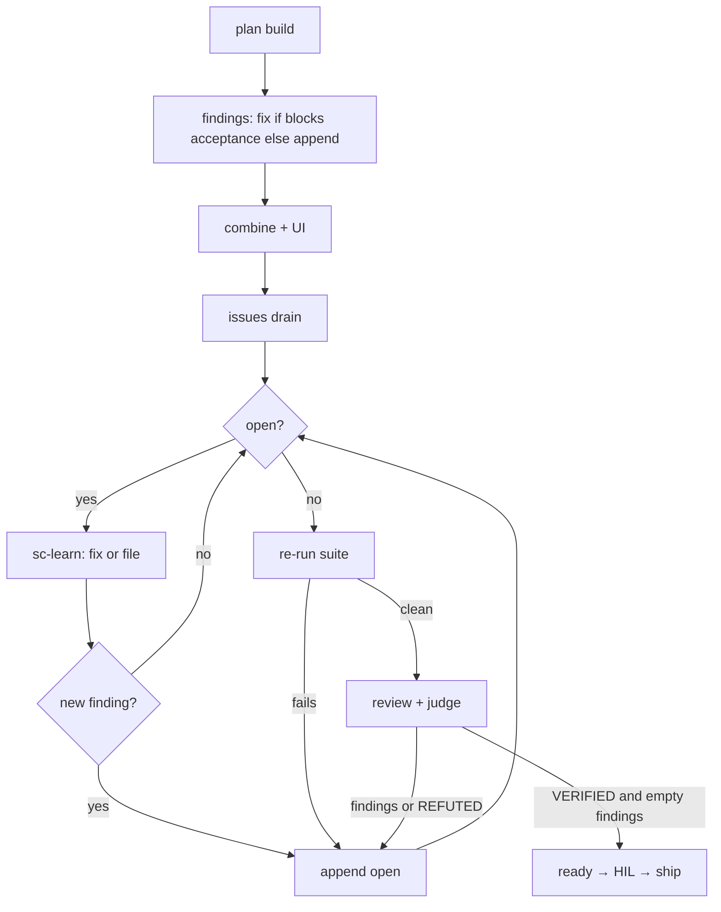

# sc-run

## Goal

After `/sc-discuss` clear, AFK incomplete work to `ready` for human check, then `/sc-ship`. Supports multi-mission roadmap queue **or** mission-only (`Sizing: single|phases`).

## Output

Missions at `state=ready` (or stop on blocked / clarify / missing draft approval). Handoff: **Ready. Human check, then /sc-ship.** Never merge/push/tag.

## Good / Bad

- Good: discuss clear first; plan → build → combine(+UI) → issues drain → review/judge; 0 open issues; empty findings; `sc-judge` `VERIFIED`; real evidence
- Bad: shipping; discuss work mid-AFK; skip drain; ready with open issues or findings; ready without `sc-judge` or without `VERIFIED`; caveat / soft-pass ready; invent phrase-echo RED for docs/prose; demanding UI draft on `*-data` / `*-functional` / `*-integrate` seams

## Verify

`spacecraft validate --strict` per mission; roadmap mode: `map next` until `All missions complete.` or blocked tip; mission-only: that one mission `ready`.

## Arguments

`$ARGUMENTS` = roadmap id (optional).

```
spacecraft map use <roadmap-id>
/sc-run <roadmap-id>
# or /sc-run  → map current if set; else mission-only on spacecraft resolve/current
```

## Lifecycle

Canonical: `.cursor/rules/200-workflow.mdc` - discuss (HIL) → run (AFK) → human check → ship.

## Pre-flight

1. Resolve mode:
   - If `$ARGUMENTS` set → `map use` that roadmap (**roadmap mode**).
   - Else if `spacecraft map current` succeeds → **roadmap mode** on that id.
   - Else resolve mission via `spacecraft resolve` / `current` → **mission-only mode** (one mission; no map required). Fail only if neither roadmap nor mission resolves.
2. Incomplete mission with `clarify-status` `open` → stop; `/sc-discuss`.
3. Draft gate (visual only):
   - Require `UI draft approved: …` when the mission is visual UI/FE (`*-ui` title, or `Sizing: single|phases` without a non-visual skip).
   - Do **not** require draft when `decisions.md` has `UI draft skipped: non-visual seam (data|functional|integrate)` or another recorded non-visual skip. `*-integrate` tips use `UI draft skipped: non-visual seam (integrate)` - no draft demanded.
   - Missing required draft → stop; `/sc-discuss`.
4. Soft gaps → `decisions.md`. No design-brief / draft-HTML discovery here.

## AFK loop

**Roadmap mode:**

```
spacecraft map next <roadmap-id>
```

Stop when: `All missions complete.`, tip `blocked`, hard clarify, or missing draft approval.

**Mission-only mode:** run the single resolved mission through **Per incomplete mission** once; then stop (no `map next`).

### Per incomplete mission

1. Parse id from `map next` (`M…:`); `spacecraft use <id>`.
2. Branch `feat/<id>/…` from main; `spacecraft bind-branch <id>` if needed.
3. Spec already discuss-ready; ensure `.space/trust/lessons.md` (sc-learn seed if missing) and skim before planning; Task(`sc-planner`) → `plan.json`; `set-state planned` then `in_progress`. Ensure mission `issues.md` / `solved.md` / `learned.md` (sc-learn).
4. **Build (per acceptance)** - for each pending task / `acceptance[]`:
   1. Triage via sc-tdd; record `skip: <reason>` when tautology (docs/prose/wording-only).
   2. **TDD:** RED Task(`sc-tester`) → checkpoint → GREEN Task(`sc-coder`/`sc-firmware`) → evidence → checkpoint.
   3. **Skip:** direct write - Task(`sc-writer`) for docs/prose/wording-only, Task(`sc-coder`) for other tautologies - → evidence with task `verify` → one checkpoint. No phrase-harness scripts.
   4. **Findings mid-build:**
      - Blocks **current** acceptance → fix now; record → `solved.md`.
      - Else → append `open` to `issues.md` (class + severity); continue plan. Drain after combine(+UI).
   5. Mark task `done` only when all its acceptances pass.
5. **Combine:** refactor; full suite; evidence. Append new failures to `issues.md`. Checkpoint.
6. **UI recheck (visual UI/FE):** sc-ux-design Step 0 **draft-parity** (side-by-side vs approved draft: tokens, layout, component chrome, scenario states) + Tier 3 visual (`playwright-cli` primary) + functional suite. Layout-only match with different chrome, or missing draft `data-state` coverage in the product, → append `open` to `issues.md`. No ready yet.
7. **Issues drain** - until 0 `Status: open` (policy: **sc-learn**):
   1. Queue open entries (critical → important → minor; mission-caused before unrelated).
   2. Act per sc-learn matrix (must-fix mission-caused; file-or-fix unrelated).
   3. Verify each action; fixed → `solved.md`; filed → `filed` + GitHub URL.
   4. New problems → append `open`; continue loop.
   5. When empty, re-run suite (+ UI if UI); reopen → drain again.
   6. Same issue fails fix-verify **3** times or hard blocker → stop to human.
8. **Review + sc-judge** (only after 0 open):
   1. Task(`sc-reviewer`); UI also Task(`sc-designer`).
   2. Run sc-judge; evidence label including `judge`. Verdict is binary: `VERIFIED` | `REFUTED` (no caveats).
   3. Any findings (any severity) or `REFUTED` → open entries in `issues.md` with `requiredFix` from reviewer/judge remediation → back to step 7 → re-review + re-judge. Do not set ready.
   4. Clean only when judge is `VERIFIED`, `review.json` has `status: ready`, and `findings` is empty: `validate --strict`; `set-state ready`.
9. Handoff: **Ready. Human check, then /sc-ship.** Continue `map next`. Squash is `/sc-ship` only.



## Checkpoint commits

Auto-commit after every RED, GREEN, skip+evidence, combine, and material drain fix. Conventional Commits; no mission id in subject/body. Never push. See sc-git.

## Rules

- Never `/sc-ship`, merge, push, tag; never discuss/draft work mid-AFK.
- One feature branch per mission id; Task-delegate product code/tests.
- Ready only after `sc-judge` `VERIFIED`, 0 open issues, and empty review findings (any severity blocks). Never ready on `REFUTED` or caveat soft-pass.
- Must drain after plan+combine(+UI) until 0 open (sc-learn policy).
- After 3 failed fix-verify on the same issue → human.

## References

- `/sc-discuss`, `/sc-ship`
- sc-learn - issues policy
- sc-judge - ready prove gate
- sc-ux-design - post-build visual QC + draft-parity
- sc-web-frontend - port look from approved draft
